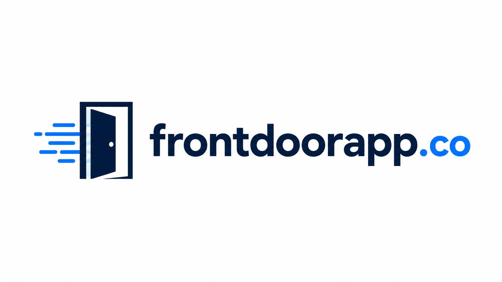
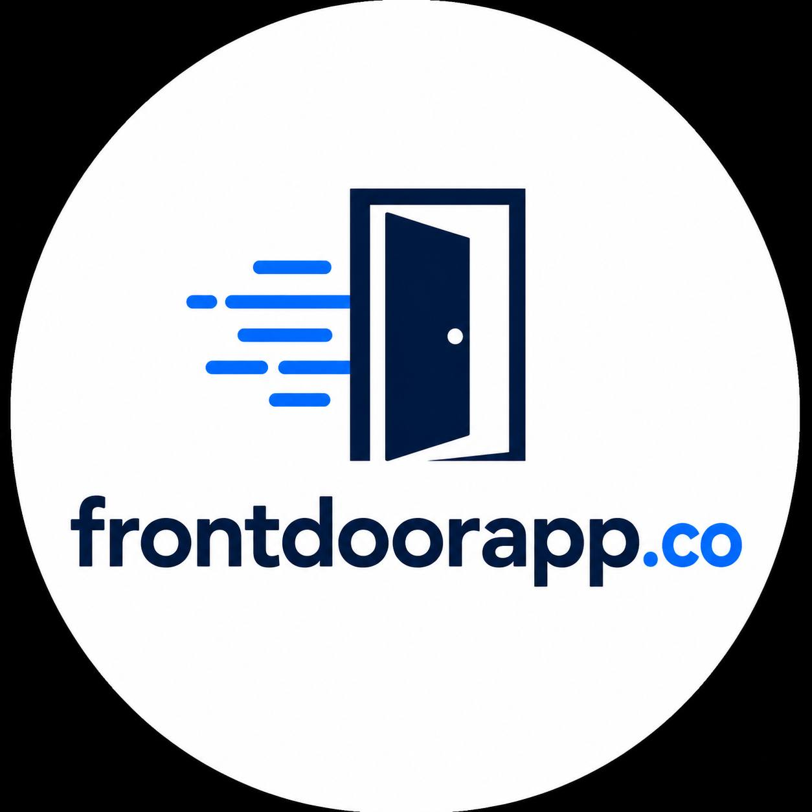

<p align="center">
  
</p>

<p align="center">
  <b>Your business's digital front door — set up once, focus on what you do best.</b>
</p>

<p align="center">
  A digital presence platform that helps business owners build and manage their<br>
  online presence, so they can spend more time running their business.
</p>

---

> This repository (`frontdoorapp-web`) is the web client for **Frontdoor**.

## The problem

Most business owners are great at their craft but stretched thin when it comes to the
digital world — websites, listings, social media links, reviews, and everything else that
makes a business look credible online. Piecing it all together (or paying several
different services to) is time-consuming and easy to neglect. The result: great
businesses getting left behind simply because they couldn't keep up online — even
though, these days, being online is a necessity for any business to thrive.

## What Frontdoor does

Frontdoor brings a business's online presence into one place and keeps it simple to
manage:

- 🚪 **One home for your presence** — a clean, professional page that represents your
  business online.
- ⚡ **Streamlined setup** — get up and running quickly without wrestling with multiple
  tools.
- 🧩 **Everything in one place** — manage your key business info, links, and updates
  from a single dashboard.
- 🌱 **Built to grow with you** — start simple and add more as your business needs it.

The goal is straightforward: **let owners spend less time managing their online
presence and more time on their actual business.**

## Project status

🚧 **Early development.** The **marketing landing page is now live at
[frontdoorapp.co](https://frontdoorapp.co)** (Next.js + Tailwind CSS, hosted on Vercel);
the Frontdoor product itself is in active development. More will be documented here as
the project takes shape.

## Getting started

The web client is a [Next.js](https://nextjs.org) app (App Router · TypeScript ·
Tailwind CSS v4). You'll need **Node.js 18.18+** (Node 20+ recommended).

```bash
# Clone the repository
git clone https://github.com/engrkenjitanaka/frontdoorapp-web.git
cd frontdoorapp-web

# Install dependencies
npm install

# Run the dev server → http://localhost:3000
npm run dev

# Production build
npm run build && npm start
```

### Project structure

```text
app/            App Router: layout (fonts + SEO metadata), page, global styles
  globals.css   Tailwind v4 brand theme (@theme tokens) + base styles
  icon.svg      Favicon — the Frontdoor "open door" mark
components/     Landing sections (Header, Hero, Features, Mission, CTA, Footer) + shared UI
public/         Logo assets (also used for OpenGraph / social link previews)
```

## Deploying to Vercel

🟢 **Live in production: [frontdoorapp.co](https://frontdoorapp.co)** — deployed on
[Vercel](https://vercel.com) with zero configuration (Vercel auto-detects Next.js).

The project is linked to Vercel and **auto-deploys on every push to `main`**; pull
requests get their own preview URLs. There are no build settings to change.

To deploy manually with the [Vercel CLI](https://vercel.com/docs/cli):

```bash
npm i -g vercel
vercel          # deploy a preview
vercel --prod   # deploy to production
```

### Early-access form

The hero and CTA email capture is built, but not yet connected to a backend. To
collect real signups, point `NEXT_PUBLIC_WAITLIST_ENDPOINT` at a URL that accepts a
`POST { email }` (a Next.js Route Handler, Formspree, Resend, etc.) — in Vercel, add
it under **Project → Settings → Environment Variables**. Until then the form
optimistically confirms, so the page stays fully usable.

## Contributing

This project is in its early days. If you'd like to get involved, feel free to open an
issue to start a conversation.

## License

License to be determined.

---

## Brand assets

Logo variants live in [`/assets`](assets):

<table>
  <tr>
    <td align="center" width="50%">
      <br>
      <sub><b>logo_banner.jpg</b><br>Horizontal — README & site headers</sub>
    </td>
    <td align="center" width="25%">
      <br>
      <sub><b>logo_square.jpg</b><br>Square — app icon & cards</sub>
    </td>
    <td align="center" width="25%">
      <br>
      <sub><b>logo_circle.jpg</b><br>Circle — avatars & social</sub>
    </td>
  </tr>
</table>

<p align="center"><sub><b>frontdoorapp.co</b> — open the door to your business's online presence.</sub></p>
